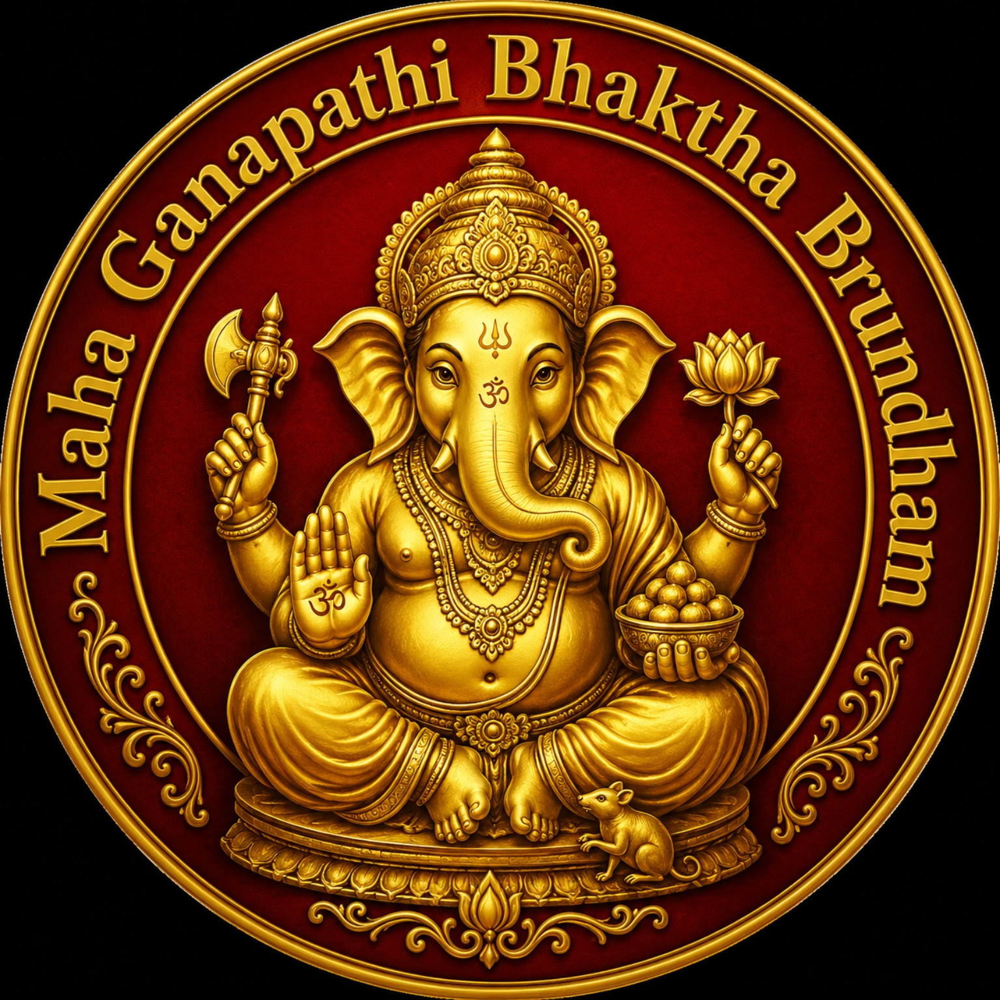

# Ganesha
<!DOCTYPE html>
<html lang="en">
<head>
    <meta charset="UTF-8">
    <meta name="viewport" content="width=device-width, initial-scale=1.0">
    <title>MAHA GANAPATHI BHAKTHA BRUNDHAM</title>
    <link href="https://fonts.googleapis.com/css2?family=Poppins:wght@400;600;700&display=swap" rel="stylesheet">
    
</head>
<body>

    

        <header>
            
            <h1>MAHA GANAPATHI BHAKTHA BRUNDHAM</h1>
            
Ganesh Chaturthi Mahotsavam · 2026

            
📍 Karanam gari street, Patamata, Vijayawada - 520010

        </header>

        <section class="events-section">
            <h2>🌺 EVENT DETAILS 🌺</h2>
            

                
                

                    <h3>🗓 Ganesh Chaturthi (Day Start)</h3>
                    
<strong>Date:</strong> 14 Sep 2026 (Monday) <strong>Time:</strong> 6:00 AM

                

                

                    <h3>🍚 Food Donation (Annadhanam)</h3>
                    
<strong>Date:</strong> 17 Sep 2026 <strong>Time:</strong> 12:00 PM

                

                

                    <h3>🍬 Laddu Auction</h3>
                    
<strong>Date:</strong> 20 Sep 2026 <strong>Time:</strong> 7:00 PM

                

                

                    <h3>🌊 Day of Visarjan</h3>
                    
<strong>Date:</strong> 20 Sep 2026 (Sunday) <strong>Time:</strong> 4:00 PM

                

            

        </section>

        <footer>
            
Ganapati Bappa Moriya 🙏

        </footer>
    

</body>
</html>
